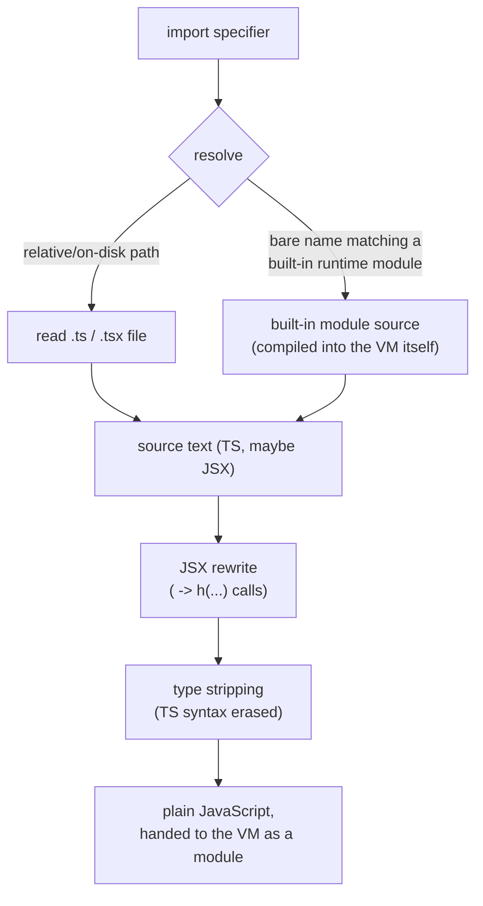

# Source transformations: from TypeScript/JSX to what the VM runs

Programs are written in TypeScript, and can use JSX. The VM only ever runs
plain JavaScript, so before a program's source reaches the VM it passes
through two independent transformations: JSX is rewritten into ordinary
function calls, and TypeScript-only syntax is erased. Neither of these is a
type checker — a program's types are expected to have already been checked
by an editor or a separate type-checking pass; what runs inside Elysium is
never type-checked at runtime, only stripped of the syntax that only a type
checker would have cared about.

The pipeline from an `import` specifier to a module the VM can run looks
like this — resolution finds the source text, wherever it lives, and then
both transformations run in sequence over it:

Type stripping's whole job is erasure, not transformation: every piece of
TypeScript-only syntax — type annotations, interfaces, type aliases,
generics, `as`/`satisfies` casts, the `?`/`!` markers, access modifiers like
`public`/`private`/`readonly`, `declare`, and so on — is replaced with blank
whitespace of the exact same length, rather than being cut out. That means
every token that survives keeps its original line and column, so a stack
trace or error position reported by the VM still points at the right place
in the original file, with no separate source map needed to translate it
back. Most TypeScript syntax really is erasable this way, since it exists
purely for the type checker and has no effect once removed. A few
constructs don't fit that story and are rejected outright rather than
guessed at: an `enum` that isn't `declare`d has real runtime behavior (it
becomes an object with forward and reverse lookups), a constructor
parameter property (`constructor(public x: number)`) is shorthand for a
runtime field assignment, `import x = require(...)`/`export =` have runtime
semantics of their own, and the legacy `<T>value` cast syntax is ambiguous
with JSX and is never accepted. A namespace is only erasable if nothing
inside it produces a runtime value — a namespace that only declares types is
fine to erase, one that also exports a function or a value is not. Any of
these show up as a compile-time error rather than being silently misread.

JSX is a different kind of transformation, because there's no JavaScript
syntax underneath it to preserve positions for — a JSX element has to become
new code, not just have some annotations blanked out. `<Tag prop={x}>child
text</Tag>` is rewritten into a call that builds a plain tree describing that
element: the tag, its properties, and its children, in the same shape
Preact's `h()` uses. A lowercase tag like `
` becomes a plain string
naming that tag; an uppercase or dotted name like `<Foo.Bar>` is treated as a
reference to a component value already in scope. Attributes become an object
of properties (`{...spread}` attributes and children are supported too), and
child text is cleaned up the way JSX always does — collapsing runs of
whitespace and blank lines the way a reader would expect, rather than
preserving them literally. `<>...</>` fragments compile to the same kind of
call using a shared `Fragment` marker. None of this needs `h`/`Fragment` to
be imported explicitly in a program, since the VM makes both available to
every program automatically before it runs. JSX can be nested arbitrarily deep, including inside ordinary
expressions like a ternary — everything outside of actual JSX syntax is left
completely untouched, byte for byte.

These two transformations run in a fixed order for a reason: JSX is
rewritten first, while its surrounding TypeScript type annotations are still
present, and only after that has produced plain calls does type stripping
erase the TypeScript syntax that's left. Running them the other way around
wouldn't work, since a JSX element inside a type-annotated position would
still be raw `<Tag>` syntax that type stripping has no reason to understand.
The result of both passes together is ordinary JavaScript, positioned so
that errors still point back at the original TypeScript/JSX source, ready to
run directly in the VM.
